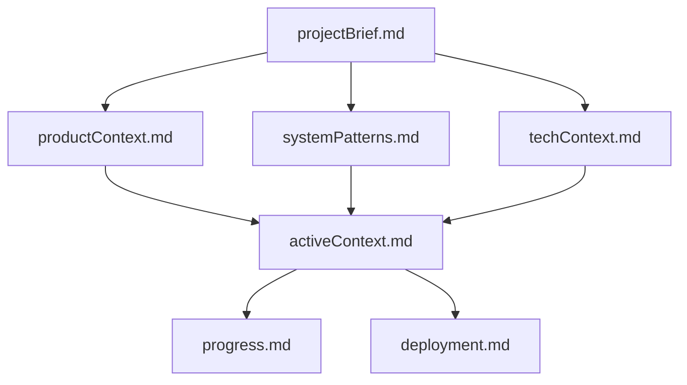

# EPUB Hyphenator - Memory Bank

## Overview

This memory bank serves as the **single source of truth** for the EPUB Hyphenator project, following the global Cline memory bank rules. It provides comprehensive documentation, context, and guidance for all development work.

## Memory Bank Structure

The memory bank follows the hierarchical structure defined in the global Cline rules:

```
memory-bank/
├── README.md              # This file - Memory bank guide
├── projectBrief.md         # Foundation document
├── productContext.md       # Why project exists
├── systemPatterns.md       # Architecture and patterns
├── techContext.md          # Technical implementation details
├── activeContext.md        # Current work focus and decisions
├── progress.md            # Implementation status and roadmap
└── deployment.md          # Deployment and production setup
```

### Document Hierarchy



## How to Use This Memory Bank

### For Cline AI Agents

#### Starting Work (Required Reading)

1. **Always start here** - Read this README first
2. **Read ALL core files** before beginning any work:
   - `projectBrief.md` - Understand project scope and requirements
   - `productContext.md` - Understand user needs and goals
   - `systemPatterns.md` - Understand architecture and patterns
   - `techContext.md` - Understand technical constraints
   - `activeContext.md` - Understand current work focus
   - `progress.md` - Understand what's built and what's needed
   - `deployment.md` - Understand production requirements

#### During Development

1. **Reference patterns** from `systemPatterns.md` for implementation decisions
2. **Follow technical standards** from `techContext.md` for code quality
3. **Check current context** in `activeContext.md` for active decisions
4. **Update progress.md** when implementing features
5. **Document new patterns** in appropriate files when discovered

#### After Major Changes

1. **Update activeContext.md** with new decisions and considerations
2. **Update progress.md** with completion status
3. **Consider updating other files** if major architectural changes occur

### For Human Developers

#### Onboarding

1. **Read in order**: Start with `projectBrief.md`, follow the hierarchy
2. **Understand current state**: Review `progress.md` for what's built
3. **Check active work**: Look at `activeContext.md` for current focus
4. **Follow patterns**: Use `systemPatterns.md` for implementation guidance
5. **Review deployment**: Check `deployment.md` for production requirements

#### Development Workflow

1. **Plan work**: Reference `progress.md` roadmap and activeContext.md priorities
2. **Implement patterns**: Follow guidance from `systemPatterns.md` and `techContext.md`
3. **Maintain documentation**: Update memory bank as decisions are made
4. **Review regularly**: Memory bank evolves with the project

## Global Cline Rules Integration

This memory bank fully incorporates all global Cline rules:

### Core Engineering Principles (00-core-engineering.md)

- **Start Simple, Stay Simple**: Frontend-first approach demonstrates this principle
- **Clarity Over Cleverness**: Explicit naming and clear patterns throughout
- **Explicit Naming**: All functions use descriptive verbs, variables use descriptive nouns
- **No Forbidden Names**: No usage of `data`, `payload`, `result`, `handleX`, etc.

### TypeScript Rules (10-typescript.md)

- **No `any` Types**: All code uses explicit typing
- **Explicit Interfaces**: Clear contracts between components
- **Domain Types**: Business-relevant type names (`Language`, `UploadFormData`)
- **Union Types**: Used for specific error cases and state variations

### Testing Rules (20-testing.md)

- **Behavior Testing**: Tests user interactions, not implementation details
- **Error Scenarios**: Comprehensive error case coverage
- **Component Isolation**: Components tested in isolation
- **No Framework Testing**: Don't test React, test component behavior

### Memory Bank Rules (80-memory-bank.md)

- **Single Source of Truth**: Memory bank contains all project knowledge
- **Hierarchical Structure**: Documents build upon each other
- **Regular Updates**: Memory bank evolves with project changes
- **Complete Coverage**: All aspects of project documented

### Context7 Documentation (90-context7.md)

- **Framework Usage**: TanStack patterns verified against official docs
- **Current Practices**: Modern React and TypeScript patterns used
- **Documentation References**: All framework work based on latest documentation

## Key Project Patterns

### Development Patterns

1. **Frontend-First**: Build complete UI before backend implementation
2. **Component-Driven**: Focused, single-responsibility components
3. **Type-Safe**: Comprehensive TypeScript with explicit types
4. **Test-Driven**: Unit tests for all core functionality
5. **CLI Integration**: External tool execution with proper error handling

### Architectural Patterns

1. **TanStack Start**: Modern React with SSR and file-based routing
2. **CLI Tool Integration**: `epub-hyphen` for professional hyphenation
3. **Functional Components**: Modern React with hooks
4. **Domain-Driven Types**: Business-relevant type design

### Code Quality Patterns

1. **Explicit Naming**: Functions are verbs, variables are descriptive nouns
2. **Fail-Fast Validation**: Immediate input validation with specific feedback
3. **Error-First Design**: Comprehensive error handling and user feedback
4. **Single Responsibility**: Each component has one clear purpose

## Current Project State

### Completed (✅)

- **Frontend**: Upload form with validation, error handling, responsive design
- **Backend**: Complete API endpoint with CLI tool integration
- **Processing**: File upload, processing, and download functionality
- **Testing**: Comprehensive unit tests for all components
- **Tooling**: ESLint, Prettier, TypeScript, Vite configuration
- **Documentation**: Complete memory bank establishment

### In Progress (🚧)

- **Deployment Preparation**: CLI tool dependency documentation
- **Performance Testing**: Large file handling validation
- **User Experience Polish**: Success feedback and enhanced progress indicators

### Not Started (❌)

- **Monitoring Setup**: Error tracking and performance monitoring
- **Advanced Features**: Custom hyphenation patterns, additional languages

## Decision Records

This memory bank contains decision records for:

### Technical Decisions

- **Framework Choice**: TanStack Start for modern React SSR
- **State Management**: React hooks for local, TanStack Query for server state
- **Styling**: Tailwind CSS for utility-first approach
- **Testing**: Vitest with React Testing Library
- **CLI Integration**: `epub-hyphen` for professional EPUB processing

### Architectural Decisions

- **Component Architecture**: Functional components with explicit types
- **Type Design**: Domain-driven types over generic structures
- **Error Handling**: Fail-fast validation with specific error types
- **Development Approach**: Frontend-first to validate requirements early
- **Processing Strategy**: External CLI tool vs. custom implementation

### Pattern Decisions

- **Naming Conventions**: Descriptive verbs for functions, nouns for variables
- **File Organization**: Feature-based component structure
- **Import Patterns**: Grouped imports with type imports when possible
- **CLI Integration**: External tool execution with proper error handling

## Maintenance Guidelines

### When to Update Memory Bank

#### Required Updates

1. **After any implementation work** - Update progress.md
2. **When making architectural decisions** - Update systemPatterns.md
3. **When changing technical approach** - Update techContext.md
4. **When shifting project focus** - Update activeContext.md
5. **When adding deployment requirements** - Update deployment.md

#### Optional Updates

1. **Discovering new patterns** - Add to appropriate files
2. **Learning new approaches** - Document in activeContext.md
3. **User feedback** - Update productContext.md if needed
4. **Deployment insights** - Add to deployment.md

### Update Process

1. **Read all relevant files** before making changes
2. **Update specific files** based on change type
3. **Review consistency** across all memory bank files
4. **Update this README** if structure changes

## Quality Assurance

### Memory Bank Quality Checks

- **Completeness**: All aspects of project documented
- **Consistency**: Information consistent across files
- **Accuracy**: Technical details match implementation
- **Clarity**: Information is clear and actionable

### Integration with Global Rules

- **Rule Compliance**: All global rules properly incorporated
- **Pattern Consistency**: Global patterns followed in project
- **Documentation Standards**: Follows memory bank documentation rules
- **Update Procedures**: Proper memory bank update processes followed

## Future Enhancements

### Potential Additions

1. **API Documentation**: When backend is implemented
2. **Deployment Guides**: Production deployment procedures
3. **User Documentation**: End-user guides and tutorials
4. **Performance Metrics**: Benchmarking and optimization guides

### Structure Evolution

1. **Specialized Documentation**: Add files for complex features
2. **Integration Guides**: API and third-party integration docs
3. **Troubleshooting**: Common issues and solutions
4. **Contributing Guidelines**: How to contribute to project

## Emergency Procedures

### Memory Bank Corruption

1. **Restore from git** if available
2. **Recreate from project code** using patterns from global rules
3. **Document reconstruction** process in activeContext.md

### Project Knowledge Loss

1. **Start with projectBrief.md** to understand requirements
2. **Review implementation** to infer patterns
3. **Reconstruct documentation** using this README as guide
4. **Verify against global rules** for compliance

---

This memory bank is the foundation for all EPUB Hyphenator development work. Maintain it carefully, update it regularly, and always reference it when making decisions about the project.

**Remember**: The memory bank resets completely between Cline sessions. This documentation is the only link to previous work and must be maintained with precision and clarity.

**New**: The `deployment.md` file provides comprehensive deployment guidance for production environments, including CLI tool installation requirements and server configuration.
